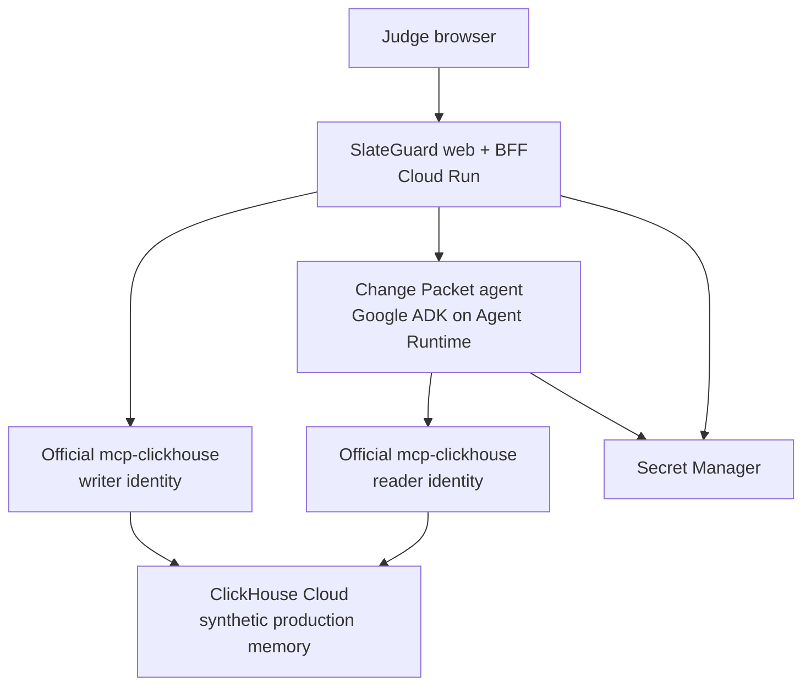

# SlateGuard — resources and implementation blueprint

> Goal: use the smallest credible set of resources to make SlateGuard unmistakably real in the ClickHouse track. The primary proof is one live loop: revision → official MCP query/write → evidence → grounded Change Packet → human follow-up → readiness update.

## 1. Architecture decision

Build a single Google ADK agent on Gemini Enterprise Agent Platform Agent Runtime, plus one public Cloud Run web service. Keep ClickHouse durable state outside the agent runtime and use the official ClickHouse MCP server on the server side only.

- The browser gets no database, MCP, or model credentials.
- The agent can retrieve curated evidence but cannot write to ClickHouse.
- The deterministic backend validates every revision and owns all writes.
- Gemini explains retrieved facts; it never writes SQL or decides whether a continuity rule passed.

This is a stronger contest story than a generic chat app: Google ADK/Agent Runtime supplies the agentic layer, while ClickHouse stores the time-aware production record that makes the answer possible.

## 2. Live organizer resources to use now

| Resource | Why it matters | Action |
| --- | --- | --- |
| [ClickHouse track resources](https://agentic-cinema.devpost.com/details/clickhouse-resources) | Official partner material for the required runtime integration. | Read before provisioning the cluster or MCP server. |
| [ClickHouse build session registration](https://us02web.zoom.us/webinar/register/2617864578383/WN_KXlTJtwET2u4S2_ynJWsnw#/registration) | Organizer session: Aug. 18, 2026, 8:00 AM PT; explicitly covers managed MCP, real-time queries, and project structure for the runtime requirement. | Register and bring the Sprint 1 questions. |
| [Gemini Enterprise Agent Platform API setup](https://cloud.google.com/vertex-ai/docs) | Official Google Cloud entry point. | Create the isolated contest project and enable the required APIs. |
| [ADK Agent Runtime quickstart](https://docs.cloud.google.com/gemini-enterprise-agent-platform/build/runtime/quickstart-adk) | The intended managed deployment path for the agent. | Follow only after the local Google + ClickHouse spike works. |
| [Google ADK MCP tools](https://adk.dev/tools-custom/mcp-tools/) | Official connection pattern for the reader MCP toolset. | Use a pinned, stdio-based official MCP server. |
| [Official mcp-clickhouse repository](https://github.com/ClickHouse/mcp-clickhouse) | Source of the actual server and its security configuration. | Pin a tested release; do not use a mocked database on the primary path. |
| [Cloud Run service identity guidance](https://docs.cloud.google.com/run/docs/securing/service-identity) and [Secret Manager guidance](https://docs.cloud.google.com/run/docs/configuring/services/secrets) | Keeps model and database credentials out of the client and repository. | Use service identities and Secret Manager, never API-key files in the app. |
| [Google Cloud credit request](https://forms.gle/XPe837tzogh8L5sX6) | The organizer announcement says requests must be made and redeemed by Aug. 31, 2026. | Submitted; treat any additional award as upside, not a build dependency because $450 is already confirmed. |

The official rules remain controlling; feature-freeze is Sept. 5 and submission is Sept. 6, leaving Sept. 7 at 2:00 PM PT only as contingency.

## 3. Resource allocation and ownership

| Resource | Ideal allocation | Definition of ready | Human-required action |
| --- | --- | --- | --- |
| Focus time | 60–70 focused hours: 7 setup/compliance, 10 data/schema, 15 MCP/rules, 12 agent/UI, 8 QA/deploy, 8 video/submission. | Calendar reserves the first two days for runtime proof only. | Protect the time. |
| Google Cloud credit | $450 confirmed. Spend it on the required managed stack, repeated hosted rehearsals, and reliability—not extra features. | Budget alert is configured; at least $150 remains reserved for final-week recovery. | Confirm billing project and credit attachment. |
| GCP project | One isolated project, billing, budget alert, Cloud Logging, Agent Runtime, Cloud Run, Artifact Registry, and Secret Manager. | Server identity can invoke Google services without local credential files. | Create project, accept billing, grant access. |
| ClickHouse Cloud | One small real demo service and dedicated SlateGuard database. | TLS connection works from the deployed environment. | Create account/service and accept any billing terms. |
| ClickHouse identities | Separate read and write database users. Read user sees curated marts only; write user can INSERT only into narrow event tables. | Reader cannot insert; writer cannot select broad production tables or drop data. | Store credentials in Secret Manager. |
| Source repository | One public-ready GitHub repository with README, LICENSE, .env.example, CONTEST.md, architecture diagram, and seed instructions. | Secret scan is clean and a new user can run the demo path. | Create repo and make it public only after review. |
| Fictional demo data | Six scenes, source excerpts, call-sheet rows, dailies notes, evidence IDs, dependencies, and revisions. | Every displayable datum is self-authored and publishable. | Review for rights and factual consistency. |
| Evaluation fixtures | 15–20 labeled changes: expected evidence IDs, continuity impacts, schedule impacts, and abstention cases. | Deterministic test run reports expected versus actual findings. | Approve the synthetic examples. |
| Submission assets | Public hosted app, screen recorder, two clean demo takes, captions, screenshots, and Devpost copy. | A clean-browser rehearsal succeeds without manual data repair. | Publish the video and make final submission. |

## 4. Minimal implementation stack

### Web and orchestration

- React single-page interface, served with a small FastAPI backend from one Cloud Run service.
- A single primary route accepts a constrained revision payload and returns the Change Packet, source evidence, impact findings, and readiness result.
- Use Cloud Run only for the public host. Do not create a second frontend deployment, authentication system, queue, ORM, vector database, or generic agent framework.

### Agent

- One synchronous Google ADK root agent, deployed to Gemini Enterprise Agent Platform Agent Runtime.
- [Gemini 2.5 Flash](https://docs.cloud.google.com/gemini-enterprise-agent-platform/models/gemini/2-5-flash) in us-central1 for schema-constrained changed-fact extraction and grounded prose generation. This keeps the model endpoint and the verified us-central1 Agent Runtime deployment aligned; do not switch models without a separate deployed spike.
- Pass the agent only the retrieved evidence and an explicit response schema. The agent should not receive arbitrary SQL, write access, or authority to mark a conflict resolved.
- If Agent Runtime is blocked after the spike day, deploy the same ADK code to Cloud Run with the official ADK path. Do not redesign the product or add a non-Google AI service.

### ClickHouse MCP boundary

Use the official Python mcp-clickhouse server as a pinned runtime dependency over stdio. Do not use [ClickHouse Cloud's managed Remote MCP](https://clickhouse.com/blog/agentic-analytics-ask-ai-agent-and-remote-mcp-server-beta-launch) for a write proof; its published remote-MCP guidance is read-only.

| Boundary | Runtime caller | Permissions | Responsibility |
| --- | --- | --- | --- |
| sg-mcp-read | ADK agent and deterministic backend | SELECT only on curated mart views, query limits | Fetch evidence and the current readiness picture. |
| sg-mcp-write | Deterministic backend only | INSERT only into event tables; write access enabled; DROP disabled | Persist a validated revision, impact snapshot, human follow-up, and readiness event. |

The writer must never be exposed as an agent tool. Build all writes from server-owned typed parameters and allowlisted query templates; never concatenate user text or model output into SQL. Use TLS, verified certificates, least-privilege ClickHouse roles, and redacted tool-call logging.

## 5. Core request sequence

1. The user changes a supported typed fact, initially Scene 12 wardrobe: blue jacket → black jacket.
2. The Cloud Run backend validates the allowed field/value and writes an immutable revision event through sg-mcp-write.
3. sg-mcp-read fetches the narrow evidence context: current and prior fact, already-shot Scene 11, two scheduled dependent scenes, and source IDs.
4. Deterministic code evaluates the continuity and schedule-impact rules.
5. The ADK agent receives only that result set and returns a structured Change Packet: finding, evidence, uncertainty, and bounded follow-up recommendation.
6. The user presses Create follow-up.
7. The backend inserts the follow-up and readiness event through sg-mcp-write, then verifies the event through sg-mcp-read.
8. The interface renders a compact Live Evidence Trace: MCP tool call, source IDs, triggered rule, action event ID, and refreshed readiness.

This exact sequence must run in the hosted app, appear in the demo video, and map to obvious source files in the repository.

## 6. Data model and evaluation resource

Keep all runtime records append-only. ClickHouse is strongest here as a time-aware production memory, not a decorative key-value store.

| Surface | Contents | Access |
| --- | --- | --- |
| core.scene_fact_versions | Versioned wardrobe, prop, location, time-of-day, and dialogue facts. | Writer inserts; reader uses current-state mart. |
| core.source_evidence | Script excerpts, dailies notes, call-sheet records, timestamps, and source IDs. | Seed only; reader uses mart. |
| core.scene_dependencies | Explicit scene/asset/schedule relationships. | Seed only; reader uses mart. |
| core.revision_events | Validated revision requests and old/new values. | Writer inserts. |
| core.impact_snapshots | Deterministic impacts plus evidence IDs used in each packet. | Writer inserts. |
| core.followup_action_events | Human-created action, owner, rationale, and timestamp. | Writer inserts. |
| core.readiness_events | Pending/resolved readiness state for the next shoot. | Writer inserts. |
| mart.impact_context and mart.readiness_by_shoot_date | Curated, read-only views used by the agent. | Reader only. |

Use versioned inserts and argMax-style current-state queries. Do not depend on asynchronous background merges for correctness in the demo path. Keep the public demo to six scenes; derive the 15–20 evaluation fixtures from mutations of those scenes rather than creating a larger, weaker product dataset.

## 7. Delivery schedule and gates

| Date | Work | Gate |
| --- | --- | --- |
| Aug. 14–15 | Access, billing caps, credit request, repository, Google call, official MCP discovery, real cluster query and write. | Stop if either required runtime is mocked, local-only, or inaccessible from deployment. |
| Aug. 16–19 | Original production bible, schema, seed/reset, curated marts, dependency graph, evaluation labels. | Six-scene reset produces predictable evidence records. |
| Aug. 20–24 | Revision route, reader/writer MCP paths, deterministic continuity/schedule rules, trace logging. | The blue-to-black revision proves both impacts and a persisted event. |
| Aug. 25–28 | ADK Change Packet, abstention state, three-screen UI, human follow-up and readiness update. | A nontechnical person understands the result in under 30 seconds. |
| Aug. 29–Sept. 1 | Deploy, public repository, license, setup guide, tests, clean-reset smoke test. | The hosted app survives three consecutive runs. |
| Sept. 2–4 | Screenshots, two functional video takes, captions, Devpost draft and full rehearsal. | Video shows the live runtime path, not slides. |
| Sept. 5–6 | Feature freeze, only regression fixes, final form review, submission. | Submission complete by Sept. 6. |

## 8. Sprint 0 checklist

- [ ] Register for the Aug. 18 ClickHouse session.
- [x] Submit the organizer Google Cloud credit request; await any award without delaying the build.
- [ ] Attach the confirmed $450 Google Cloud credit to the isolated project and configure a $300 alert.
- [ ] Create the isolated GCP project and ClickHouse Cloud service.
- [ ] Create the reader and writer database roles; store credentials only in Secret Manager.
- [ ] Create the repository and add the OSI license, CONTEST.md, .gitignore, and .env.example.
- [ ] Pin the official mcp-clickhouse version and prove one reader query plus one writer event locally.
- [ ] Repeat that proof from the deployed environment before any serious UI work.

## 9. Non-negotiable cuts

Do not spend resources on authentication, collaboration, notifications, generic chat, video upload/analysis, an ORM, vector search, a second database, media generation, or multiple agents. They neither strengthen the required runtime proof nor increase the chance of a top-three result.

## 10. Credit strategy

Treat $450 as a reliability budget, not permission to broaden scope:

- First priority: deploy the real Google ADK Agent Runtime and Cloud Run path early, then leave it reachable for repeated end-to-end tests.
- Second priority: run the 15–20 labeled evaluation cases against the real environment, including clean reset and missing-evidence cases.
- Third priority: retain at least $150 for final-week recording, deployment recovery, and judge-access smoke tests.

Do not add models, extra agents, media generation, or additional data services merely because the credit is available. The top-three advantage comes from a robust visible proof chain, not cloud-service breadth.
