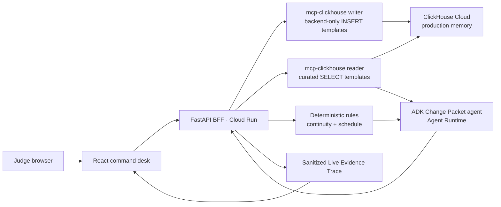

# Technical Specification

## Overview

SlateGuard is a single-purpose production change-control application. Its hosted demo proves one consequential loop: a script supervisor changes Scene 12 wardrobe from **blue jacket** to **black jacket**; the backend records the change through the official ClickHouse MCP server; curated evidence is retrieved; deterministic rules identify a continuity conflict and schedule dependency; a Google ADK agent turns those bounded facts into a Change Packet; and the supervisor explicitly creates a follow-up whose persisted receipt updates shoot readiness.

The technical shape is deliberately small. The browser never receives a model key, ClickHouse credential, MCP endpoint, or arbitrary-SQL capability. It receives typed data and a legible evidence trace from one public application.

Implements: `prd.md > Product Summary`, `prd.md > Core User Journey`, `prd.md > Product Principles`

### Build decisions

- **Public app:** React + TypeScript + Vite, built as static assets and served by a FastAPI backend in one Cloud Run service.
- **Agent:** one Google ADK Change Packet agent deployed to Gemini Enterprise Agent Platform Agent Runtime in `us-central1`, using `gemini-2.5-flash` and structured output.
- **Production memory:** one real ClickHouse Cloud service, accessed at runtime only with the official Python `mcp-clickhouse==0.4.1` server over stdio.
- **Security boundary:** a reader MCP identity can run only narrow `SELECT` queries on curated views; a writer MCP identity is backend-only and can `INSERT` only typed event records. The agent never receives the writer identity.
- **Demo data:** six self-authored fictional scenes plus 15–20 deterministic evaluation mutations. The visible happy path is the prepared Scene 12 change.
- **Delivery choice:** unauthenticated public demo, deterministic reset, no uploads, no generic chat, no queues, no ORM, no vector store, and no second database.

## Stack

| Layer | Choice | Why it is here |
| --- | --- | --- |
| Interface | React, TypeScript, Vite, CSS custom properties | Gives the demo a responsive, data-dense command-desk experience without a second deployment. |
| Public API | FastAPI, Pydantic | Owns validation, deterministic rules, MCP lifecycle, and the browser-safe response contract. |
| Agent | Google ADK + Gemini Enterprise Agent Platform Agent Runtime + `gemini-2.5-flash` | Meets the Google agent requirement while keeping model prose schema-constrained and fact-bounded. |
| Durable production memory | ClickHouse Cloud | Stores append-only revisions, impact snapshots, human follow-ups, readiness events, and evidence marts. |
| Partner integration | Official `mcp-clickhouse==0.4.1` Python server | Makes the required ClickHouse runtime integration observable in the core loop. |
| Hosting and secrets | Cloud Run, Artifact Registry, Secret Manager, Cloud Logging | Provides a public URL, deployable image, secret injection, and traceable runtime evidence. |
| Test tooling | Pytest, frontend component tests, Playwright smoke test | Tests rules and contracts separately, then verifies the hosted end-to-end demo. |

Authoritative implementation references: [FastAPI](https://fastapi.tiangolo.com/), [Vite](https://vite.dev/guide/), [Cloud Run](https://cloud.google.com/run/docs), [Google ADK](https://google.github.io/adk-docs/), [Agent Runtime quickstart](https://docs.cloud.google.com/gemini-enterprise-agent-platform/build/runtime/quickstart-adk), and [official mcp-clickhouse](https://github.com/ClickHouse/mcp-clickhouse).

## Architecture



### Trust and authority model

| Actor | May do | Must not do |
| --- | --- | --- |
| Browser | Submit the single supported revision, read evidence, request a follow-up, reset the public fixture. | Supply SQL, invoke MCP, select owners, or access secrets. |
| FastAPI backend | Validate typed input; launch read/write MCP subprocesses; run deterministic rules; invoke the ADK agent; persist user-approved action. | Concatenate user/model output into SQL or grant database credentials to the client. |
| Reader MCP process | Query only `mart.*` curated views and bounded verification views. | Write, drop, enumerate unrestricted production data, or accept model SQL. |
| Writer MCP process | Insert validated revision, impact, follow-up, and readiness events using server-owned templates. | Select arbitrary data, drop data, or become an ADK tool. |
| ADK agent | Produce a schema-valid explanation and bounded recommendation from supplied evidence/rule output. | Write to ClickHouse, invent evidence, determine rule outcomes, or create a follow-up. |
| Human supervisor | Decide whether to create the recommended follow-up. | Be replaced by autonomous downstream action. |

Implements: `prd.md > Product Principles`, `prd.md > Epic 4`, `prd.md > Epic 5`

## File Structure

```text
slateguard/
├── frontend/
│   ├── src/
│   │   ├── app/                 # route and demo-session shell
│   │   ├── features/revision/   # prepared Scene 12 revision control
│   │   ├── features/packet/     # Change Packet, evidence, impacts, receipt
│   │   ├── features/trace/      # readable Live Evidence Trace
│   │   ├── features/ledger/     # quiet secondary Scene Ledger
│   │   ├── components/          # reusable visual primitives
│   │   ├── lib/api.ts           # typed browser API client
│   │   └── styles/              # black/green palette; yellow trace token
│   └── tests/
├── backend/
│   ├── app/
│   │   ├── main.py              # FastAPI app and static asset hosting
│   │   ├── api/                 # typed request/response routes
│   │   ├── domain/              # Pydantic contracts and rule types
│   │   ├── services/
│   │   │   ├── revision_flow.py # complete revision-to-packet orchestration
│   │   │   ├── followup_flow.py # human action + read-after-write receipt
│   │   │   ├── rules.py         # deterministic continuity/schedule rules
│   │   │   └── demo_reset.py    # controlled fixture reset
│   │   ├── mcp/
│   │   │   ├── reader.py        # reader child and named query templates
│   │   │   └── writer.py        # writer child and typed INSERT templates
│   │   ├── agents/
│   │   │   ├── change_packet.py # ADK root agent and response schema
│   │   │   └── gateway.py       # Agent Runtime invocation adapter
│   │   └── observability/       # redaction and trace-event builder
│   └── tests/
├── clickhouse/
│   ├── schema.sql               # append-only tables and curated marts
│   ├── seed.sql                 # six-scene synthetic production fixture
│   └── fixtures/                # labeled change/evidence expectations
├── probes/                      # Sprint-0 isolated real-runtime proofs
├── infra/
│   ├── Dockerfile
│   ├── cloudrun.yaml
│   └── agent-runtime/           # deploy package and configuration only
├── docs/
│   ├── hackathon-build/         # scope, PRD, spec, checklist
│   └── runbooks/                # provisioning, reset, demo rehearsal
└── README.md                    # judge setup, architecture, proof map
```

## Data Model

All runtime data is append-only; the application derives current state from versioned records instead of mutating a row in place. UUIDs are generated server-side. Timestamps are UTC `DateTime64(3)`. Every displayed source or action gets a stable identifier.

| Table / view | Key fields | Writer | Purpose |
| --- | --- | --- | --- |
| `core.scene_fact_versions` | `fact_id`, `scene_id`, `fact_type`, `value`, `valid_from`, `source_id` | seed + writer | Versioned production facts, including Scene 12 wardrobe. |
| `core.source_evidence` | `evidence_id`, `scene_id`, `kind`, `excerpt`, `occurred_at` | seed | Fictional dailies, call-sheet, and source record evidence. |
| `core.scene_dependencies` | `dependency_id`, `source_scene_id`, `target_scene_id`, `dependency_type`, `shoot_date` | seed | Explicit asset and schedule relationships. |
| `core.revision_events` | `demo_session_id`, `revision_id`, `scene_id`, `fact_type`, `old_value`, `new_value`, `recorded_at` | writer | Immutable user-initiated change scoped to one public demo session. |
| `core.impact_snapshots` | `demo_session_id`, `packet_id`, `revision_id`, `impact_type`, `evidence_ids`, `rule_version` | writer | Deterministic result used by the Change Packet. |
| `core.followup_action_events` | `demo_session_id`, `action_id`, `revision_id`, `owners`, `status`, `created_at` | writer | Explicit human-owned follow-up. |
| `core.readiness_events` | `demo_session_id`, `readiness_event_id`, `revision_id`, `state`, `reason`, `recorded_at` | writer | Shoot-readiness history. |
| `mart.impact_context` | session-scoped revision/fact/evidence/dependency context | read-only view | The bounded context supplied to the rules and agent. |
| `mart.readiness_by_shoot_date` | session-scoped readiness state by date | read-only view | Read-after-write confirmation and ledger display. |

The reader uses named query templates with fixed parameters such as `revision_id` and `scene_id`; the writer uses named `INSERT` templates with values supplied by validated Pydantic models. There is no endpoint that accepts SQL.

Implements: `prd.md > Epic 2`, `prd.md > Epic 3`, `prd.md > Epic 6`

## Data Flow

### A. Apply the prepared revision

1. The browser calls `POST /api/revisions` with the fixed supported payload: `scene_id=scene-12`, `fact_type=wardrobe`, `old_value=blue jacket`, and `new_value=black jacket`.
2. `RevisionRequest` validates the allowed scene, field, and transition. Invalid or arbitrary values receive a safe `422` response.
3. The backend invokes the writer MCP child with `CLICKHOUSE_ALLOW_WRITE_ACCESS=true` and `CLICKHOUSE_ALLOW_DROP=false` to append the revision event.
4. The backend invokes the reader MCP child to retrieve `mart.impact_context` for that revision. The result includes the changed fact, Scene 11 dailies evidence, and the two upcoming dependent scenes.
5. Pure application code evaluates exact rules: a prior-shot conflicting wardrobe record produces `continuity_conflict`; scheduled dependencies produce `schedule_dependency`. Rules return evidence IDs, affected scenes, and confidence/state—not prose.
6. The backend writes the resulting impact snapshot through the writer MCP child.
7. The ADK Change Packet agent receives only a `GroundedPacketInput` (validated fact, evidence snippets/IDs, deterministic findings, and allowed owners). It returns a schema-valid `ChangePacketNarrative`; unsupported claims fail validation and fall back to deterministic copy.
8. The API returns `RevisionAnalysisResponse`: packet, source evidence, impacts, readiness `At risk`, and sanitized trace steps. The interface animates only from those returned trace states.

### B. Create the human-approved follow-up

1. The browser calls `POST /api/revisions/{revision_id}/follow-up` only after it holds a supported packet.
2. The backend verifies that the stored impact snapshot is actionable; no client-supplied owners or action text are trusted.
3. It inserts a `followup_action_event` for Wardrobe and Assistant Director plus a `readiness_event` of `Follow-up created` through the writer MCP process.
4. It retrieves the exact persisted `action_id` and refreshed readiness via the reader MCP process.
5. The API returns a `DecisionReceipt` with action ID, owners, time, supporting evidence IDs, and readiness transition. A duplicate request returns the existing receipt rather than inserting another action.

### C. Abstention and recovery

- Missing evidence or contradictory source records produce `Review required`, display the relevant records, and omit the follow-up control.
- A failed agent invocation leaves the deterministic packet and evidence intact, marked `Analysis incomplete`; no follow-up is recorded.
- `POST /api/demo/reset` mints a new signed short-lived `demo_session_id` and returns the known synthetic baseline. It never deletes or mutates shared ClickHouse records; existing sessions remain inspectable until expiry.

## API Contracts

| Route | Request | Success response | Guardrail |
| --- | --- | --- | --- |
| `GET /api/demo/state` | none | current Scene 12 fact, demo readiness, secondary ledger summary | No secrets or raw database fields. |
| `POST /api/revisions` | `RevisionRequest` + `Idempotency-Key` header | `RevisionAnalysisResponse` | Allowlisted fact/value pair; session-scoped idempotency; typed only. |
| `POST /api/revisions/{revision_id}/follow-up` | no free-form body | `DecisionReceipt` | Requires stored, actionable impact snapshot; duplicate-safe. |
| `POST /api/demo/reset` | current demo-session cookie/token | clean `DemoState` with a new session | Fixture-only endpoint; mints a session rather than clearing shared data. |
| `GET /api/ledger/scenes/{scene_id}` | fixed scene ID | `SceneLedgerResponse` | Curated read-only data; quiet secondary UI. |
| `GET /healthz` | none | liveness result | No dependency details exposed publicly. |

Primary response types:

```text
RevisionAnalysisResponse
  revision: { revision_id, scene_id, fact_type, previous_value, new_value }
  packet: { status, summary, impacts[], recommended_action?, evidence[] }
  readiness: { state, reason, updated_at }
  trace: [{ step, status, public_detail, evidence_ids?, correlation_id? }]

DecisionReceipt
  action: { action_id, owners: ["Wardrobe", "Assistant Director"], status, created_at }
  revision_id
  readiness_transition: { from: "At risk", to: "Follow-up created" }
  evidence_ids: []
```

## Components And Responsibilities

### Command Desk Interface

Implements: `prd.md > Epic 1`, `prd.md > Epic 2`

The first screen is a focused Scene 12 record, not a dashboard. It makes the current blue-jacket fact and the single `Apply revision` action unmistakable. The visual system is ClickHouse-adjacent in interaction—query/evidence-forward, tight typography, traceable state—while using a near-black shell and decisive green for confirmed states. ClickHouse yellow appears only on evidence/query moments; off-white source cards preserve readability.

### Change Packet and Evidence Panel

Implements: `prd.md > Epic 3`, `prd.md > Epic 4`

Renders the typed revision, the two deterministic impacts, three primary source records, bounded Gemini explanation, and the Live Evidence Trace. Its compact `Runtime proof` expansion shows the official MCP package version, sanitized correlation ID, read/write/read status, source IDs, action ID, and reader-confirmed readiness—never endpoints, credentials, or raw SQL. Evidence cards display source IDs and scene status before any consequential action. The interface does not expose prompt text, raw SQL, or a generic chat input.

### Revision Flow Service

Implements: `prd.md > Epic 2`, `prd.md > Epic 3`, `prd.md > Edge Cases`

Coordinates validated event insertion, evidence read, deterministic rule evaluation, impact snapshot persistence, and ADK explanation. It creates a single correlation ID for logs and public trace events while redacting all credential/configuration information.

### ClickHouse MCP Adapters

Implements: `prd.md > Epic 4`, `prd.md > Epic 6`

Launch separate official MCP child processes with isolated environments. The reader is configured read-only with hard execution/read limits. The writer environment is never available to the agent and enables only writes required by named insertion templates. Both adapters record a sanitized tool-call outcome for the Live Evidence Trace.

### Deterministic Rule Engine

Implements: `prd.md > Epic 3`, `prd.md > Edge Cases`

Produces verifiable structured findings from retrieved evidence. It owns whether a continuity conflict, schedule dependency, contradiction, or abstention exists. It has no model dependency, ensuring the visible claims stay repeatable across demo runs.

### Change Packet Agent

Implements: `prd.md > Epic 3`, `prd.md > Product Principles`

The Google ADK root agent runs in Agent Runtime, accepts one structured context, and returns a strict Pydantic-compatible response. Its instruction requires it to cite only provided evidence IDs, distinguish unknowns, preserve deterministic labels, and recommend only the allowed Wardrobe + Assistant Director follow-up. It is an explanation layer, not the authority layer.

### Follow-up and Decision Receipt Service

Implements: `prd.md > Epic 5`, `prd.md > Epic 6`

Accepts the supervisor's explicit decision, checks idempotency, persists the action and readiness transition, then proves the write using a reader MCP query before responding. The receipt is a permanent-feeling end state, not a toast or redirect.

## External APIs And Dependencies

| Dependency | Integration | Runtime verification |
| --- | --- | --- |
| ClickHouse Cloud | TLS to port 8443 from reader/writer MCP child processes; least-privilege users stored in Secret Manager. | Real reader query, typed writer event, and reader verification recorded in Sprint 0 and replayed in staging. |
| Official `mcp-clickhouse` | Pinned Python `0.4.1`, stdio child processes, separated environments. | Package/version is logged; reader write attempt and writer broad-read attempt are denied in the probe. |
| Gemini Enterprise Agent Platform | ADK app deployed to Agent Runtime in `us-central1`; FastAPI invokes its narrow Change Packet endpoint. | Structured-output Gemini call and deployed Agent Runtime request pass before UI integration. |
| Secret Manager | Cloud Run and Agent Runtime identities read only their necessary secrets. | Deployment has no checked-in credential files; startup fails closed when required configuration is absent. |
| Cloud Logging | Correlation ID, route outcome, MCP outcome, agent schema result, and reset event. | Logs contain no passwords, tokens, prompts with secrets, or full connection strings. |

### Required configuration

Only environment variable names and secret references may be committed. Values live in local `.env` during local proof and Secret Manager after deployment:

```text
GOOGLE_CLOUD_PROJECT
AGENT_RUNTIME_RESOURCE
CLICKHOUSE_HOST
CLICKHOUSE_DATABASE
CLICKHOUSE_READER_SECRET_REF
CLICKHOUSE_WRITER_SECRET_REF
```

`CLICKHOUSE_ALLOW_WRITE_ACCESS=true` exists only in the writer child environment; `CLICKHOUSE_ALLOW_DROP=false` is explicit. The reader child receives neither writer credentials nor write access.

## AI Usage

1. The backend retrieves factual evidence first through the reader MCP adapter.
2. Deterministic code determines impact labels, evidence IDs, readiness state, and whether the action can be offered.
3. The ADK agent receives the bounded context and produces concise grounded language under a structured response schema.
4. Server-side validation rejects evidence IDs not present in the input, unknown status labels, unapproved owners, and empty required fields.
5. If validation or agent invocation fails, SlateGuard keeps the factual result and displays a clear incomplete-analysis state. It never fabricates a confident explanation.

This separates model fluency from production authority and makes the agent's role legible to judges.

## Risks And Verification

| Risk | Mitigation | Required proof |
| --- | --- | --- |
| ClickHouse looks decorative | Make every core-path persistence and evidence read pass through official MCP; surface sanitized trace events. | Hosted demo shows revision write, evidence read, follow-up write, and reader verification. |
| Agent Runtime deployment blocks progress | Prove it early; keep the ADK implementation portable to Cloud Run as a documented contingency. | Sprint-0 deployed structured request before UI investment. |
| Model invents production claims | Rules own labels; agent gets only retrieved facts; validate cited evidence IDs. | Fixture tests include missing/contradictory evidence and invalid agent response. |
| Duplicate follow-up | Use session-scoped `Idempotency-Key` uniqueness and read-before/after-write check. | Same session/key and payload returns the original response; a mismatched payload returns `409`; no extra event. |
| Public reset corrupts credibility | Mint a new signed demo session instead of deleting shared data; make reset visibly demo-only and rate-limit it. | Three concurrent clean-browser runs are isolated and each gives the same happy-path result. |
| Sensitive data leak | Synthetic content only, Secret Manager, browser-safe response DTOs, and redacted logs. | Secret scan, dependency audit, and manual public-response review. |

### Definition of done

- The public Cloud Run URL completes the happy path from a clean browser without manual data repair.
- The same run visibly shows the real ClickHouse-backed trace and a Google-generated, schema-valid Change Packet.
- Missing-evidence, contradiction, failed-analysis, and repeat-action behavior are covered by deterministic tests.
- The public repository has an OSI license, architecture/proof map, seeded fictional-data notice, setup instructions, and no credentials.
- A three-minute recording covers the functional loop, trace, human decision, persisted receipt, and source-code/runtime mapping.

## Demo And Submission Flow

1. Start on the public Scene 12 record; orient the viewer to the current blue-jacket fact.
2. Apply blue jacket → black jacket and let the Live Evidence Trace show revision saved, evidence retrieved, and rule triggered.
3. Open the compact Change Packet: its top strip states `1 shot continuity conflict · 2 scenes on tomorrow's call sheet · Wardrobe + AD review required`; then show source IDs and grounded explanation.
4. Select `Create follow-up`; show the MCP-backed action persistence and reader-confirmed `Follow-up created` readiness receipt.
5. Expand Runtime proof for one uninterrupted segment: official MCP version, sanitized correlation/action IDs, ClickHouse write/read states, and reader-confirmed readiness. Show one `Review required` abstention screenshot before the closing proof map.
6. Briefly open the secondary Scene Ledger and then the repository diagram/configuration guide to make the actual Google + ClickHouse runtime path auditably obvious.
7. Rehearse this exact path from clean reset three times before recording; no slides may substitute for the functional flow.

Implements: `prd.md > Submission Proof Points`
